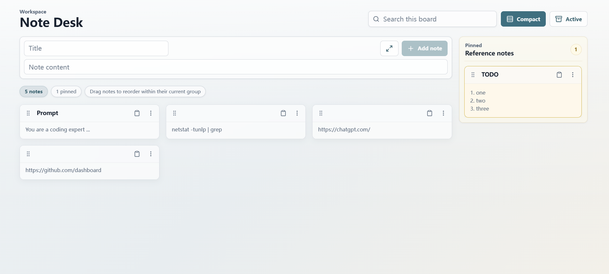

# Note Desk



Note Desk is a small local-first notes workspace for capturing short development notes, commands, links, and follow-up tasks. It runs as a React/Vite frontend and can run either as a browser-based local web app or as a Tauri desktop app with native window controls, a tray menu, a global shortcut, and local SQLite storage.

## Design Core

- **Capture first**: the page is optimized for quickly entering a thought without navigating away from the board.
- **Lightweight workspace UI**: the interface keeps a quiet, professional surface with compact controls, readable cards, and restrained motion.
- **Local-first persistence**: data stays in a local SQLite database by default, with no external service dependency.

## Features

- Focused large-editor note capture with optional titles
- Search across note titles and content
- Full and compact display modes for unpinned notes
- Pin notes to a dedicated reference sidebar
- Archive, restore, edit, copy, and delete actions
- Magnetic drag-and-drop ordering within pinned and unpinned groups
- Local SQLite persistence
- Tauri desktop mode with system tray and `Ctrl + Shift + Space` show/hide shortcut

## Requirements

- Node.js 20 or newer
- npm

The app uses `better-sqlite3`, which may require native build tooling if a prebuilt package is not available for your Node.js version or platform.

Desktop builds also require the Tauri toolchain:

- Rust stable toolchain via [rustup](https://rustup.rs/)
- Microsoft C++ Build Tools / Visual Studio Build Tools on Windows
- Microsoft Edge WebView2 Runtime, normally already present on modern Windows 10/11 systems

After installing Rust, confirm the desktop build tools are available:

```bash
rustc --version
cargo --version
```

## Installation

Clone the repository, then install dependencies from the project root:

```bash
npm install
```

No external database or hosted service is required. The first server start creates a local SQLite database automatically.

For a fresh clone that will build the desktop app:

```bash
npm install
npm run desktop:portable
```

This downloads Node dependencies, resolves Rust crates through Cargo, builds the React frontend, builds the Tauri app, and writes a Windows portable ZIP to `output/NoteDesk-portable-win-x64.zip`.

## Running Locally

### Web Mode

Start the API server and Vite development server together:

```bash
npm run dev
```

This launches:

- Express API: `http://127.0.0.1:4000`
- Vite client: the local URL printed by Vite, usually `http://127.0.0.1:5173`

Open the Vite client URL in your browser. The client talks to the local API during development.

To run the frontend and backend separately:

```bash
npm run dev:server
npm run dev:client
```

### Desktop Mode

Start the Tauri desktop app:

```bash
npm run desktop:dev
```

Desktop mode reuses the same React UI, but calls Tauri commands instead of the Express API. The window can be shown or hidden with `Ctrl + Shift + Space` by default; closing the native window hides it to the tray. The tray menu provides **Show/Hide** and **Quit**.

Use the settings button in the top toolbar to configure the global shortcut, font scale, and light/dark theme. Shortcut changes apply to the desktop app; the web app keeps the setting for consistency but cannot register system-level shortcuts.

Build the desktop app:

```bash
npm run desktop:build
```

Create a Windows portable ZIP:

```bash
npm run desktop:portable
```

The portable ZIP is written to `output/NoteDesk-portable-win-x64.zip`. In desktop mode, SQLite data is stored next to the executable in `data/note-desk.sqlite`, so the app directory can move as a unit.

## Usage

- Click **New note**, or press `Enter` while the page is focused and not while typing in a control, to open the large capture editor.
- Press `Ctrl + Enter` on Windows/Linux or `Cmd + Enter` on macOS inside a note editor to save and close.
- Closing the large editor saves non-empty changes automatically. Use **Discard** to abandon the current draft or edit.
- Double-click a note body, or use the note menu, to open the large editor.
- Drag a note by its grip handle to reorder it. Pinned notes reorder only within the right reference sidebar; unpinned notes reorder only within the main board.
- Use search to filter the current board. Sorting is paused while searching or viewing archived notes.
- Use the density toggle to switch unpinned notes between full cards and compact one-line cards. Pinned sidebar notes keep their own stable layout.
- Delete removes a note immediately without a browser confirmation prompt.

## Configuration

The server reads these environment variables:

| Variable | Default | Description |
| --- | --- | --- |
| `PORT` | `4000` | Port used by the Express API and production server. |
| `NOTES_DB_PATH` | `data/dev-notes.sqlite` | SQLite database file path. Parent directories are created automatically. |

Examples:

```bash
# macOS/Linux
PORT=4100 NOTES_DB_PATH=./data/local.sqlite npm start
```

```powershell
# Windows PowerShell
$env:PORT="4100"
$env:NOTES_DB_PATH="D:\note-desk\data\local.sqlite"
npm start
```

## Data Storage

By default, Note Desk stores data in `data/dev-notes.sqlite` and enables SQLite WAL mode, which also creates `*.sqlite-wal` and `*.sqlite-shm` files next to the database. The `data/` directory is ignored by Git.

In Tauri desktop mode, Note Desk stores data next to the executable at `data/note-desk.sqlite` to keep portable builds self-contained. Desktop settings are stored next to it at `data/settings.json`.

To back up your notes, stop the server and copy the SQLite database files from the configured data directory.

## Tech Stack

- React + TypeScript
- Vite
- Express + TypeScript
- Tauri + Rust for desktop mode
- SQLite via `better-sqlite3`
- SQLite via `rusqlite` in desktop mode
- `dnd-kit` for drag interaction
- Lucide React icons

## Production Build

Build the frontend:

```bash
npm run build
```

Start the Express server:

```bash
npm start
```

When `dist/` exists, Express serves both the built client and the API from the same process at `http://127.0.0.1:4000` unless `PORT` is set.

You can also preview the built frontend with Vite:

```bash
npm run preview
```

## GitHub Release (Portable ZIP)

- Push a version tag like `v0.1.0` to trigger the release workflow:

```bash
git tag v0.1.0
git push origin v0.1.0
```

- You can also run the workflow manually from GitHub Actions by providing an existing tag in the `tag` input (for reruns/re-publish).
- The workflow runs `npm ci`, then `npm run check`, then `npm run desktop:portable`, and uploads `output/NoteDesk-portable-win-x64.zip` to the GitHub Release.

### Troubleshooting

If `npm run check` fails with `Cannot find module ...`, ensure dependencies are installed in the repository root:

```bash
rm -rf node_modules
npm cache verify
npm ci
npm run check
```

On Windows PowerShell:

```powershell
Remove-Item -Recurse -Force node_modules
npm cache verify
npm ci
npm run check
```

## Scripts

- `npm run dev` starts the API and Vite client together.
- `npm run dev:server` starts the Express API in watch mode.
- `npm run dev:client` starts the Vite development server.
- `npm run build` builds the frontend.
- `npm start` starts the Express server.
- `npm run preview` serves the production frontend bundle with Vite.
- `npm run check` runs TypeScript checking and the production build.
- `npm run desktop:dev` starts the Tauri desktop app.
- `npm run desktop:build` builds the Tauri desktop app.
- `npm run desktop:portable` builds and zips a Windows portable app folder.

## Project Structure

```text
server/        Express API and SQLite setup
src/           React application
src-tauri/     Tauri desktop shell, Rust commands, tray, shortcut, desktop SQLite
data/          Local SQLite database files, ignored by Git
dist/          Production frontend build, generated by npm run build
output/        Generated portable ZIPs and other local artifacts, ignored by Git
```

## License

No license has been selected yet.
